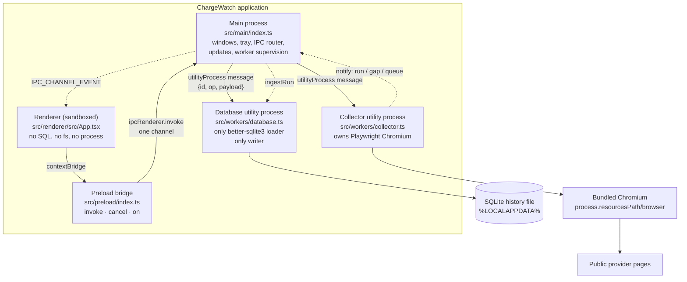
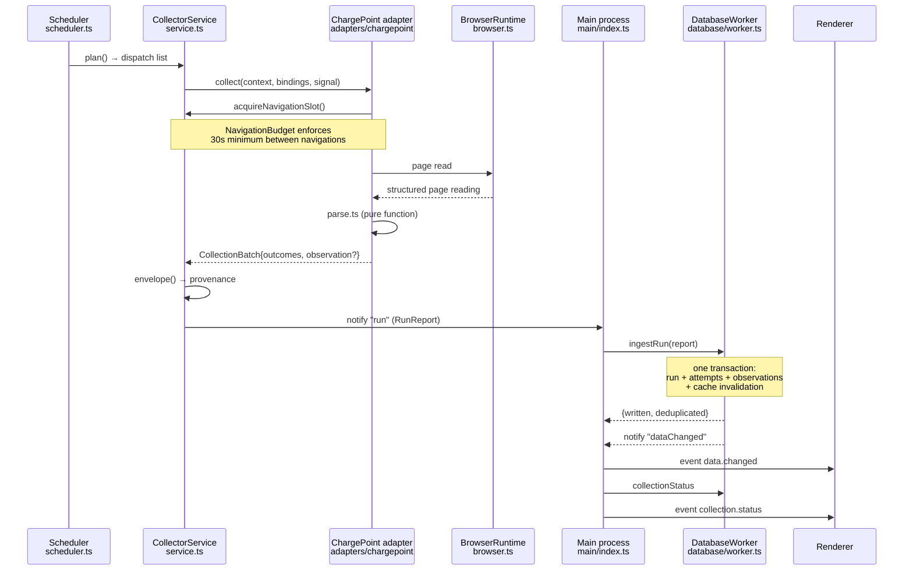

# Architecture

This document describes how ChargeWatch is put together: which processes exist,
what each one is allowed to do, how a collection run travels from a scheduler
decision to a row in SQLite and then to the interface, and where the security
and update boundaries sit. It is written for someone who has to change this
code or review a change to it, and it assumes you will read the referenced
files rather than trust a summary. Where a module is written but has never been
executed, that is stated at the point it is described, not only in the closing
section. The project's governing constraint is data honesty: no fabricated
observation, no missing value rendered as zero, no check reported as having run
when it did not. Most of the structure below exists to make those failures hard
rather than to make the code tidy.

## Process model

ChargeWatch runs as four processes.

### Why the work is split this way

The split is not about tidiness. Each boundary prevents one specific failure
that was judged unacceptable for a tool whose output is a historical record.

**The database worker exists so the native SQLite binding is loaded exactly
once, in one process, and so that process is the only writer.**
`src/workers/database.ts` is the only module in the tree that imports
`openBetterSqlite`, and its header says so. A second writer in the main process
or the renderer would mean two connections racing on a WAL database, and the
failure would not be a crash — it would be lock contention and partially
applied batches, which corrupts a history silently. Keeping SQL and aggregation
off the main process also keeps the event loop free: `export.rawObservations`
carries a 600-second timeout in the contract, and a query of that duration on
the main process would freeze the window and the tray for ten minutes.

**The collector worker exists so a Chromium or Playwright crash cannot take
down the interface or the database.** `src/main/workers.ts` states this
directly. The collector drives a real browser against pages it does not
control; that browser will sometimes die. When it does, `collectFromSource` in
`src/collector/service.ts` catches it and converts it into failed
`collection_attempts` rows plus a `browser_failure` gap. The window stays up,
the database is untouched, and — critically — the crash does not become an
observation. A single-process design would have made a browser fault
indistinguishable from an application fault, and the tempting repair (retry and
carry on) would have left an unrecorded hole in coverage.

**The renderer is sandboxed and reaches nothing directly.**
`RENDERER_WEB_PREFERENCES` in `src/main/security.ts` sets `contextIsolation`,
`sandbox` and `webSecurity` true and `nodeIntegration`,
`nodeIntegrationInWorker`, `nodeIntegrationInSubFrames` and `webviewTag` false.
The renderer's own `src/renderer/src/api.ts` has no SQL, no filesystem access
and no `process` object; if a value is not on a view model, the renderer does
not have it. That matters for honesty as much as for security: a renderer that
could query SQLite could compute its own version of occupancy, and the single
definition in `src/domain/metrics.ts` would stop being single.

**Provider pages never load in a privileged context.** The collector's browser
has no preload and no Node bridge (`src/main/security.ts` header;
`src/preload/index.ts` header). A provider page is untrusted HTML, and it is
read by a process that can do nothing but read it.

### Message shape

Both workers speak the same correlated request/response protocol, defined in
`src/main/workers.ts`: `{ id, op, payload }` in, `{ id, ok, value }` or
`{ id, ok: false, error }` out, plus unsolicited `{ notify, payload }` for
things the worker initiates. `SupervisedWorker` restarts a worker that exits
with bounded backoff (`RESTART_BACKOFF_MS = [1_000, 2_000, 5_000, 15_000,
30_000]`, capped by `maxRestarts`, default 10), and on exit it rejects every
in-flight request rather than leaving callers hanging. `onRestarted` lets the
caller re-establish state: for the database worker that means reopening, and
for the collector it means `loadCollectorState()` followed by a conditional
`start`. `stop()` asks for a graceful `shutdown` first and only then kills — and
it kills only a process ChargeWatch started.

## Startup order, and why the order is a data-safety property

`bootstrap()` in `src/main/index.ts` runs a fixed sequence, documented in the
file's own header. The ordering is deliberate at every step.

1. **Single-instance lock**, taken at module scope before anything else:
   `if (!app.requestSingleInstanceLock()) app.quit()`. Two ChargeWatch
   processes would mean two collectors and two update coordinators. Two
   collectors against one provider would breach the rate budget that
   `src/collector/scheduler.ts` enforces per source, and two writers would race
   on the same SQLite file. A second launch instead activates the existing
   window through the `second-instance` handler.
2. **Resolve paths and open the log.** `resolveDataPaths()` from
   `src/main/paths.ts` runs before anything can write, and its `warnings` are
   logged immediately — including `cloud_roaming_directory`, because a live
   SQLite database inside OneDrive or a roaming profile is a corruption risk
   worth naming out loud.
3. **Open the database**, via `startDatabase()`. This is where recovery,
   the pre-migration backup and migration happen, inside the worker. If
   `databaseState.status !== 'ready'` the function shows a dialog that states
   explicitly that existing data has _not_ been changed, and returns without
   starting anything else.
4. **Only if the database is ready**, start the collector and run the health
   checks. This is the load-bearing ordering: `bootstrap()` guards
   `startCollector()` behind `if (databaseState?.status === 'ready')`. A
   collector started against a database that failed to migrate would produce
   readings with nowhere to go. `CollectorService.submitRun` would be called,
   `ingestRun` would throw, and the readings would be lost — but the provider
   would still have been polled, so the history would contain a period with no
   observations and no recorded gap either. Refusing to collect at all is the
   honest outcome, and the status line says so instead.
5. **Resume collection only if it was already running** and the user had not
   paused it: `if (setting('collection.running', false) && !setting('collection.userPaused', false))`.
6. **Create the tray, then the window** (unless `--hidden`, which the login
   item passes so a start-with-Windows launch does not push a window at the
   user).
7. **Start update checks last**, through `startUpdates()`. Updates are the only
   subsystem that can restart the application, so it is initialised after
   startup has settled and after `maintenanceActive`, `sessionEnding` and the
   window state it gates on are all real.

Shutdown mirrors this. `gracefulQuit()` stops the collector first (25-second
deadline), then the database worker (20 seconds), then destroys the tray and
closes the log. `before-quit` is intercepted so a quit always takes this path,
and `powerMonitor.on('shutdown')` sets `sessionEnding = true` before quitting,
which is what stops the updater from starting an installer while Windows is
signing the user out.

## A collection run, end to end

**The scheduler decides.** `Scheduler.plan()` in
`src/collector/scheduler.ts` returns a dispatch list, a `queueLag` and an
`achievableIntervalMs`. Its guarantees are worth restating because they are all
honesty constraints in disguise: due times persist as UTC milliseconds while
in-process delays use a monotonic clock, so a system clock change cannot
stampede the queue; a per-source token bucket enforces the minimum navigation
interval and manual refresh spends the _same_ budget; transient failures back
off exponentially with jitter capped at six hours; authentication walls,
challenges and access blocks _pause_ the source rather than retrying forever;
and on restart overdue work is spread rather than fired at once. The last point
is why waking from sleep does not produce a request storm — and
`spreadOverdue()` is called in both `start()` and `onResume()`.

Crucially, a source whose `eligibilityState` is not `enabled` is registered but
marked ineligible. `registerAdapter()` sets
`eligible: capabilities.eligibilityState === 'enabled'` and logs a warning that
no collection will occur. This is the gate that keeps an unverified source from
ever being read. **The shipped ChargePoint adapter declares
`eligibilityState: 'needs_review'` and `verificationState: 'blocked'`
(`src/collector/adapters/chargepoint/index.ts`), so in the current build this
gate is closed and no collection happens at all.**

**The browser reads a page.** `src/collector/browser.ts` owns the Playwright
Chromium: `resolveBundledChromium()` looks under
`join(resourcesPath, 'browser', 'chrome-win', executable)` and
`join(resourcesPath, 'browser', executable)`, and `playwright-core` is imported
lazily inside `launch` so merely loading the collector does not require the
binary to exist. **This file has never been executed** — see the closing
section.

**A pure parser extracts the reading.**
`src/collector/adapters/chargepoint/parse.ts` is a pure function over a
structured page reading, which is what makes it testable without a browser and
what keeps DOM-shaped guesswork out of the count logic. Its behaviour is
covered by specs in `tests/nodeps/chargepoint-parse.test.ts`: unknown is not
treated as available, aggregate-only summaries stay aggregate, connectors are
not conflated with ports, "last used" is never counted as occupancy, and an
identity mismatch is rejected rather than attributed to the wrong station.

**The service wraps the reading in a provenance envelope.**
`CollectorService.envelope()` in `src/collector/service.ts` produces an
`EnvelopedObservation` carrying `sourceUrl`, `parserVersion`
(`sourceId@adapterVersion`), `evidenceFingerprint`, `sanitizedSourceText`,
`quality`, `sourceFreshness` and — importantly — the `freshnessPolicy` that was
in force at the moment of the reading. Port rows are carried through _only_
when both the source capability and the binding declare `identityReliability:
'durable'`; otherwise the array is emptied here as well as in the adapter, so
there is no path by which a page's display order becomes a port identity.

The `evidenceFingerprint` deserves a note: `fingerprint()` at the bottom of
`service.ts` is an FNV-1a digest used for provenance labelling only, and the
comment states it is deliberately _not_ used to discard a repeated identical
status. The same status at a new scheduled time is new evidence and is kept.

**Main hands the run to the database worker.** The collector never writes
SQLite. It posts `notify: 'run'` and `onCollectorNotification` in
`src/main/index.ts` forwards the `RunReport` straight to
`db('ingestRun', report, 120_000)`, then refreshes collection status. The same
handler routes `gap` to `recordGap`, `queue` to `persistQueue` and
`sourceHealth` to `persistSourceHealth`.

**Ingestion is idempotent and atomic.** `DatabaseWorker.ingestRun` in
`src/database/worker.ts` wraps everything in one `transact()`: the
`collection_runs` row, every `collection_attempts` row, the observations via
`observationsRepository.ingest`, and the aggregate-cache invalidation. Either
all of it lands or none of it does, so a reader can never see new raw data
beside stale aggregates. The unique index that makes a retry safe is
`ux_observations_run_binding_scope`; see DATA_MODEL.md for the full argument.
`ingestRun` also refuses outright while a migration or restore is in progress.

**The UI is notified.** The worker emits `notify('dataChanged', { reason:
'observations' })` when `written > 0`, `onDatabaseNotification` re-emits it as
the `data.changed` event, and the renderer treats its cached view models as
stale. Status changes travel the same way via `collection.status`.

## `--self-check`

`--self-check` in `src/main/index.ts` runs the real startup sequence with no
window, no tray, no collection loop and no updater, writes a machine-readable
JSON report and exits with the verdict as its exit code.

It exists because the things most likely to be broken in a packaged build
cannot be established before packaging: a native SQLite module that will not
load for the Electron ABI, a bundled Chromium that is not where
`process.resourcesPath` says it should be, migrations that were not embedded.
Establishing those needs the installed application to actually open its
database and actually start its browser.

The report separates two kinds of result, because conflating them would make
the check either useless or dishonest:

- **Integrity** — `SELF_CHECK_INTEGRITY_IDS = ['data_dir', 'database',
'browser']`. These must pass. A failure means the package is broken, and the
  exit code is 1.
- **Readiness** — `SELF_CHECK_READINESS_IDS = ['sources', 'catalog']`. These
  are reported but do not fail the run.

The split exists because readiness checks are _expected_ to be unmet in a
correct fresh install: no source has been cleared for collection and no catalog
has been imported. Failing on them would mean a correct package could never
pass, which would train whoever reads the report to ignore it. So they are
reported as unmet rather than as broken — a distinction the report's own `note`
field spells out for the reader.

Two further details keep the check honest. Every line comes from the same
`runHealthChecks()` the onboarding screen shows, so there is no separate,
friendlier code path for the automated check. And a check that did not run is
recorded as `status: 'not_run'` with the detail `'the check did not run'` —
never as a pass. If `runSelfCheck()` itself throws, the handler in
`app.whenReady()` exits 1, because a crash in the check is a failure of the
check.

Note that `runHealthChecks()` reports the network check as `not_applicable`
with the explanation that it is checked when collection runs, so ChargeWatch
does not make a request purely to test it.

## The IPC contract

There is **one** request channel, `chargewatch:request`, and one event channel,
`chargewatch:event` (`src/shared/ipc.ts`). There is no general-purpose invoke
surface. Every operation is named in the `OPERATIONS` registry with a request
schema, a response type, a `timeoutMs`, and `mutating` / `cancellable` flags.

`IpcRouter.handle` in `src/main/router.ts` applies the checks in a fixed order:

1. **Sender identity**, via `isTrustedSender()` in `src/main/security.ts`,
   which rejects a message from a subframe, from an unrecognised window id, or
   from a document that is not the application's own origin.
2. **Envelope validation** against `requestEnvelopeSchema`.
3. **Contract version equality** — a mismatch returns
   `contract_version_mismatch` rather than a guess. A renderer and a worker
   built from different versions refuse to talk.
4. **Name resolution** against the registry, then handler lookup.
5. **Payload validation** with the operation's own schema.
6. **Timeout and cancellation** through an `AbortController`.

Validation happens at the boundary and is hand-written
(`src/shared/validate.ts`, ADR-0002) rather than delegated to Zod. The reasons
are recorded in the ADR: the npm registry was unreachable, so Zod schemas could
not have been _executed_ here, and unexecuted validation at a trust boundary is
exactly the wrong thing to trust. The validator keeps `null` and `undefined`
distinct, strips unknown keys so a compromised renderer cannot smuggle fields
into a worker call, rejects fractional integers rather than rounding,
range-checks instants, and strips prototype-pollution payloads. Note that
`src/domain/types.ts` still carries a stale header comment pointing at
`src/shared/contracts` and Zod; no such module exists.

Destructive operations encode confirmation _in the schema itself_, so an
unconfirmed request cannot reach a handler: `restore.perform`,
`data.deleteRange` and `update.restartAndInstall` each `.refine()` on
`confirmed` being true.

`router.missingHandlers()` is called at the end of `registerHandlers()` and logs
any contract operation with no handler, so that gap is a build-time error
rather than a runtime surprise.

The tray is worth a mention because it is the exception that proves the rule.
`TrayController`'s `onTogglePause` calls the `db()` and `collector()` helpers
directly instead of round-tripping through the router — and the comment in
`src/main/index.ts` explains why: the tray lives in the main process, not a
renderer, so the router would correctly reject it as an untrusted sender.

**Not wired:** `src/preload/index.ts` exposes `cancel(requestId)`, and four
operations declare `cancellable: true` — `overview.get`, `map.getMarkers`,
`station.getDetail` and `export.rawObservations`. But
`invoke()` generates its request id internally and never returns it, and
`src/renderer/src/api.ts` exports no `cancel` at all. As written, the renderer
cannot cancel an in-flight operation; the router-side machinery is complete and
unreachable.

## Security posture

The policy lives in `src/main/security.ts` as pure decision functions so it can
be tested rather than asserted, and it is applied in `src/main/window.ts`.

**CSP.** `buildContentSecurityPolicy()` emits `default-src 'self'` and, in
production, `script-src 'self'` with no remote script origin at all. Fonts are
`'self' data:`; there is no Google Fonts host and no CDN. `img-src` adds the
configured tile origin because an interactive basemap needs remote images, and
`connect-src` adds the tile and update origins. `media-src`, `object-src`,
`frame-src`, `child-src`, `form-action` and `base-uri` are all `'none'`, as is
`frame-ancestors`. Development adds only the Vite dev server origin and its
websocket spelling, and the two modes are built from the same function with an
`isDevelopment` flag rather than merged — so a development exception cannot leak
into a production build. The header is applied through
`session.webRequest.onHeadersReceived`.

**Navigation.** `decideNavigation()` returns `allow` only for the app's own
origin (with a href-prefix comparison for `file://`, whose origin serialises as
`"null"`), `open_externally` for an allowlisted external origin, and `deny` for
everything else. `javascript:`, `data:` and `blob:` are denied by name before
any other test. It is wired to both `will-navigate` and
`setWindowOpenHandler`, so neither an in-window navigation nor a popup escapes
it. The allowlist in `src/main/index.ts` is explicit: `TILE_ORIGINS`,
`UPDATE_ORIGINS` and `EXTERNAL_LINK_ORIGINS`.

**Permissions.** `GRANTED_PERMISSIONS` is an empty array and
`decidePermission()` denies everything, wired to both
`setPermissionRequestHandler` and `setPermissionCheckHandler`. ChargeWatch needs
no permission, which is also why no permission prompt ever appears.

**Diagnostic redaction.** `diagnostics.export` is user-initiated, previewable,
and reports its own `contents` list. `redactDiagnosticText()` strips whole
header _values_ for `authorization` and `cookie` families (not just the first
word, so `Bearer <token>` does not leave the token), plus api-key/token/secret/
password assignments, bearer tokens, GitHub `gh*_` tokens, JWTs, email
addresses and the user's home path in both slash spellings. That is best-effort
redaction layered on a stronger rule: profiles, credentials and the database
are never included in the bundle at all.

**Data paths.** `resolveDataPaths()` puts everything under the user's _local_
application data, outside the install directory — an install directory is
replaced by an update, and history stored there would be destroyed by one. It
warns on cloud-roaming folders. `isPermittedWriteDestination()` is called by
`chooseSavePath()` before any export or diagnostics write and refuses
destinations inside the live database directory, the browser profile directory
or the update cache; the refusal surfaces as a dialog and a
`path_not_permitted` error rather than a silent overwrite.

The set of outbound connections that are a normal part of running ChargeWatch
is enumerated in code, in `DOCUMENTED_OUTBOUND_CONNECTIONS`: the enabled
source, OpenStreetMap tiles (optional) and GitHub update checks (optional).

## Updates: where verification sits

The design in `src/main/updates.ts` is shaped by two facts stated in its
header. First, electron-updater's install API has changed across versions, so
the library is reached only through the `UpdaterBackend` interface, implemented
once for the pinned dependency in `src/main/updates-backend.ts`. Nothing else
calls the library directly. Second, the library's own uncontrolled install path
is disabled — `configureManualControl()` turns off automatic download and
install, and `autoInstallOnAppQuit` is off, so there is no backdoor
install-on-quit.

**Verification sits entirely before installation, and it happens twice.**

The manifest and its detached signature are fetched as release assets and
passed to `verifyManifest()` (`src/shared/release-manifest.ts`) with the
trusted keys, application id, platform, arch, accepted channels, protocol
version, the highest previously accepted release sequence, and
`writableDbSchema: TARGET_SCHEMA_VERSION`. Signature verification is Ed25519
over the exact bytes written to disk, checked _before_ parsing. A rejection
records a `manifest_rejected` event and sets a failure state whose message says
the installation is unchanged. Then `isDirectUpgradePermitted()` is consulted
before the manifest is accepted.

Only after that does `download()` run. When the download completes,
`verifyStagedArtifact()` reads the **final downloaded bytes** and passes them to
`verifyArtifactBytes()` against the already-verified manifest — the comment is
explicit that this checks the downloaded file, not a checksum fetched beside
it. A mismatch discards the artifact and leaves the installation unchanged.
Only then does the state become `ready` and `tryInstallAtSafePoint()` get
called.

Installation is additionally gated on circumstance, not just authenticity. The
`gates` supplied from `src/main/index.ts` are `trayHiddenForMs`,
`maintenanceActive`, `sessionEnding` and `foregroundActive`. `maintenanceActive`
is set around exports, backups, restore and range deletion, so an update cannot
begin while the database is being rewritten. Before installing,
`prepareForInstall` shuts the collector down and records an `update_install`
gap, and `createPreUpdateBackup` takes a `pre_update` backup.

If no verification keys are embedded, `startUpdates()` logs that no update can
be verified or installed and returns. It does not fall back to installing
unverified updates. Updates are disabled entirely in development builds, and
`electron-updater` is imported lazily so a development run never loads it.

The `update_events` and `update_state` tables record what happened; see
DATA_MODEL.md. `highest_accepted_sequence` is what makes a replayed or equal
release sequence rejectable.

## Build topology

`npm run build` is `check:migrations && electron-vite build && node
scripts/build-workers.mjs` — three bundles from `electron.vite.config.ts` plus
two worker entries from a second pass.

**Why a second pass.** electron-vite's `main` / `preload` / `renderer` configs
do not cover extra Node entry points, and `utilityProcess.fork` needs a real
file on disk. `scripts/build-workers.mjs` builds
`src/workers/database.ts` and `src/workers/collector.ts` into `out/workers/` as
CJS with `inlineDynamicImports`. The script's header names the failure this
prevents: without it the packaged app starts, finds no worker, and fails at
runtime with a message that looks like a corrupt install. The script exits
non-zero if either entry is missing rather than producing a partial build.

**Why `better-sqlite3` and `playwright-core` are external.** Both are declared
in `NATIVE_OR_BINARY_DEPS` and excluded from every bundle. `better-sqlite3` is
a native addon and `playwright-core` depends on binaries on disk; bundling them
produces a build that fails at _runtime_ rather than at build time, which is
the worse failure because it ships. They stay in production `dependencies` and
are unpacked from the asar by electron-builder. The preload gets
`format: 'cjs'` with `inlineDynamicImports` because it runs in a sandboxed
context and must be a single file with no dynamic imports.

**Why Chromium ships outside `app.asar`.** `electron-builder.yml` places the
payload via `extraResources` at `resources/browser/`, and it is resolved at
runtime from `process.resourcesPath` by `resolveBundledChromium()`. A browser
executable cannot be launched from inside an asar archive, and nothing may
depend on the _builder's_ home cache, which does not exist on a user's machine.
For the same reason `asarUnpack` lists `better-sqlite3`, `bindings` and
`file-uri-to-path`: a native module cannot be loaded from inside an archive.

The installer is a full NSIS package, not a web installer, because the bundled
browser must be present offline — a web installer would download at first run,
which is exactly what the product promises not to do. It is per-user with
`allowElevation: false`, so a nondeveloper is never shown an elevation prompt
they cannot satisfy. `deleteAppDataOnUninstall: false`: uninstalling keeps the
user's history, and removing data is a separate explicit action.

`scripts/after-pack.mjs` fails the build if `chrome.exe` is not found under
`resources/browser`, rather than producing a package missing its browser. The
migrations module is checked for staleness by `check:migrations` before
anything is built.

## What is not built or not proven yet

This section is accurate as of reading the source on 2026-09-17 and reconciles
against `docs/IMPLEMENTATION_STATUS.md` and `docs/VERIFICATION_REPORT.md`. Both
of those documents are **stale in the optimistic direction about what is
missing and pessimistic about what exists** — details at the end.

**Typechecked, linted and formatted.** `npm run typecheck`, `npm run lint` and
`npm run format` all run clean on Linux with Node 22.22.2. `src/workers/*.ts`
had been in neither tsconfig project, so they were never typechecked and eslint
could not parse them; they are in `tsconfig.node.json` now. The dependency-free
suite executes TypeScript through Node's type stripping, which runs code but
does not check types, so this is a separate guarantee rather than a redundant
one.

**Lockfile present.** `package-lock.json` is committed; install with `npm ci`.
`npm run build` succeeds on Linux, which produces the bundles but not a package;
`electron-builder --win` still needs a Windows host. Electron itself has been run
there — `release\win-unpacked\ChargeWatch.exe` launches — and one installer has
been produced, which crashes on install. See `docs/HANDOFF.md` section 1a.

**Never executed at all.** These modules are complete and reviewable, but
nothing has run them:

- `src/collector/browser.ts` — bundled Chromium runtime, page pool, readiness.
- `src/collector/adapters/chargepoint/index.ts` — the Playwright wiring around
  the tested parser. The parser itself (`parse.ts`) _is_ tested.
- `src/collector/service.ts` — orchestration and provenance envelopes.
- `src/main/workers.ts`, `src/main/updates.ts`, `src/main/updates-backend.ts` —
  worker supervision and the update service, including all the install gates.
- `src/preload/index.ts` — the bridge. The UI specs install a stub bridge, not
  this one.
- `src/workers/{database,collector}.ts` — the utility-process entry points. They
  build and typecheck; nothing has forked them.

The renderer under `src/renderer/` is no longer on that list: it builds, and the
42 UI specs under `tests/ui/` pass against `out/renderer/` in Chromium. That is
a browser with a stub bridge and synthetic fixtures — no Electron, no database,
no network — so it establishes the honesty rules on screen and nothing about
the application as installed.

`src/database/worker.ts` has been smoke-run against `node:sqlite` (it opens,
migrates with WAL, seeds settings, exports CSV, and correctly refuses a backup
on a driver without online-backup support) but has **never run under Electron
with better-sqlite3**. The two drivers differ around `backup()` and `pragma()`.

**No Windows build.** The NSIS installer, the bundled Chromium payload, the
native SQLite rebuild for the Electron ABI, `--self-check` against a real
package, and the A→B installed update proof all require a Windows host, which
was not available.

**No source is eligible and no catalog ships.** The ChargePoint adapter
declares `needs_review` / `blocked` because there was no route to
`driver.chargepoint.com` or its terms pages. No station catalog data is in the
tree, because `afdc.energy.gov` was unreachable and inventing station rows was
not an option. **The application therefore cannot currently record a single
observation.** The `catalog` and `sources` readiness checks are expected to
fail on a fresh install, which is why `--self-check` does not fail on them.

**Tables with no write path.** Five tables are created by migration 001 and
never inserted into anywhere in `src/`: `ports`, `connectors`,
`binding_merge_history`, `inferred_episodes` and `hourly_metrics`. The domain
logic for episodes (`src/domain/episodes.ts`) and metrics
(`src/domain/metrics.ts`) is written and tested, but its results are computed
live and never persisted — `metricsCacheRepository` only ever marks
`hourly_metrics` rows stale and counts them. This is not currently a
correctness problem (a cache that is never populated is merely unused), but it
means the aggregate-cache invalidation in `ingestRun` is invalidating nothing.

**A latent foreign-key fault on the per-port path.** `observationsRepository`
inserts `port_observations` rows whose `port_id` is constructed in
`CollectorService.envelope()` as `` `${binding.scopeKey}:${port.sourcePortId}` ``,
but nothing ever inserts into `ports`, and `port_observations.port_id`
references `ports(id)` with `foreign_keys = ON`. I confirmed against the real
schema with `node:sqlite` that this insert raises `FOREIGN KEY constraint
failed`, which would abort the entire `ingestRun` transaction and lose the run.
The path is currently unreachable because the only adapter declares
`identityReliability: 'none'`, so `envelope()` always emits `ports: []`. It
would fire the first time a source with durable port identity was enabled.
Nothing in `tests/nodeps/` covers it.

**Renderer cannot cancel.** As described above, the cancellation path is
implemented in the router and the preload but is not reachable from the
renderer.

**No soak, no screenshots.** No bounded soak has run, because a soak needs a
live source. There are no screenshots: the only rendering so far is headless
Chromium over synthetic fixtures, so there is nothing real to photograph, and
none were faked.

### Where the existing status documents disagree with the source

Report these rather than trusting either document:

- `IMPLEMENTATION_STATUS.md` lists I1 (`src/main/index.ts`, `window.ts`,
  `tray.ts`), I2 (the renderer), I3 (`scripts/`), I4 (packaging config), I6
  (CI, issue and PR templates, dependabot) and I7 (Vitest and Playwright
  projects) as _outstanding_. All of them now exist in the tree. It also says
  `package.json` points at `out/main/index.js`, "which does not exist yet" — the
  source does.
- It says a list of scripts is "deliberately absent from `package.json` rather
  than present as stubs" — `dev`, `build`, `package:win`, `verify:package`,
  `setup:browser`, `catalog:refresh`, `keys:bootstrap`, `release:*`,
  `test:installed`, `test:update`. Every one of those scripts is now present,
  and `scripts/windows/test-installed.ps1` and `test-update.ps1` both exist.
- The test count has been stated as **329 specs / 55 suites** and later as
  **380**. Running `node scripts/test-nodeps.mjs` today gives **516 tests / 142
  suites, 516 passing, 0 failing**, and `npm test` runs the same specs under
  Vitest. A count written into prose is stale the moment a spec is added, and
  every figure in this list has been wrong at least once; the runner's output
  is the authority.
- Both documents state the schema has **54 indexes**. `001_initial.sql`
  contains **39 explicit `CREATE INDEX` statements** (12 of them `UNIQUE`). The
  table count of 28 is correct. The higher figure is presumably counting
  SQLite's implicit primary-key and unique-constraint indexes, but it is not
  the number of indexes in the file.
- `VERIFICATION_REPORT.md` criterion 11 says "the tray and single-instance lock
  are I1". They are written, though still never executed, so the _substance_ of
  "not proven" stands — it is the reason that is out of date. Criterion 10 used
  to say the renderer is not built; it is built now, and the criterion has been
  corrected.
- `src/domain/types.ts` has a header comment saying runtime validation "lives
  in `src/shared/contracts` (Zod)". There is no such module, and ADR-0002
  records the decision not to use Zod.
